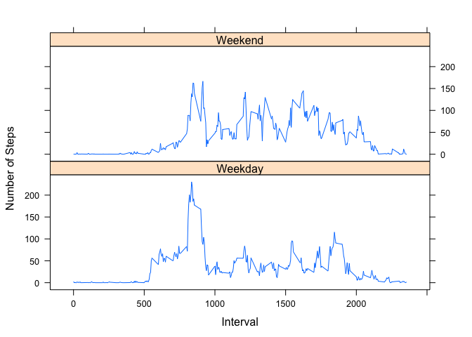

# Reproducible Research: Peer Assessment 1


## Loading and preprocessing the data

```r
unzip("activity.zip")
activity <- read.csv("activity.csv", colClasses=c("integer","Date","integer"))
```

## What is mean total number of steps taken per day?
* Make a histogram of the total number of steps taken each day

```r
totalsteps <- aggregate(activity[,"steps"], by=list(activity$date),FUN=sum, na.rm = TRUE)
names(totalsteps) <- c("date","steps")
hist(totalsteps$steps, main = "Steps Per Day", xlab="Total Steps", ylab="Frequency")
```

 

* Calculate and report the **mean** and **median** total number of steps taken per day

```r
mean(totalsteps$steps)
```

```
## [1] 9354.23
```

```r
median(totalsteps$steps)
```

```
## [1] 10395
```

## What is the average daily activity pattern?
* Make a time series plot (i.e. `type = "l"`) of the 5-minute interval (x-axis) and the average number of steps taken, averaged across all days (y-axis)

```r
Avgsteps <- aggregate(activity[,"steps"], by=list(activity$interval), FUN=mean, na.rm=TRUE)
names(Avgsteps) <- c("interval","steps")
plot(Avgsteps$interval, Avgsteps$steps, type="l", xlab="Time Intervals (5-minute)", 
     ylab = "Mean Steps", main = "Average Steps Taken at 5 minute Intervals")
```

 

* Which 5-minute interval, on average across all the days in the dataset, contains the maximum number of steps?

```r
Avgsteps$interval[which.max(Avgsteps$steps)]
```

```
## [1] 835
```

## Imputing missing values
* Calculate and report the total number of missing values in the dataset (i.e. the total number of rows with `NA`s)

```r
sum(is.na(activity))
```

```
## [1] 2304
```

* Devise a strategy for filling in all of the missing values in the dataset. To fill in missing value in dataset with mean for that 5-minute interval.
* Create a new dataset that is equal to the original dataset but with the missing data filled in.

```r
updactivity <- activity 
for (i in 1:nrow(updactivity)) {
    if (is.na(updactivity$steps[i])) {
        updactivity$steps[i] <- Avgsteps[which(updactivity$interval[i] == Avgsteps$interval), ]$steps
    }
}
```

* Make a histogram of the total number of steps taken each day and Calculate and report the **mean** and **median** total number of steps taken per day.

```r
totalsteps <- aggregate(updactivity[,"steps"], by=list(updactivity$date),FUN=sum, na.rm = TRUE)
names(totalsteps) <- c("date","steps")
hist(totalsteps$steps, main = "Steps Per Day", xlab="Total Steps", ylab="Frequency")
```

 

```r
mean(totalsteps$steps)
```

```
## [1] 10766.19
```

```r
median(totalsteps$steps)
```

```
## [1] 10766.19
```

Do these values differ from the estimates from the first part of the assignment?

* The value differs from first part of the assignment.

What is the impact of imputing missing data on the estimates of the total daily number of steps?

* The mean and median total number of steps taken per day is higher.

## Are there differences in activity patterns between weekdays and weekends?
* Create a new factor variable in the dataset with two levels -- "weekday" and "weekend" indicating whether a given date is a weekday or weekend day.

```r
days <- weekdays(updactivity$date)
updactivity$day <- ifelse(days == "Saturday" | days == "Sunday", "Weekend", "Weekday")
```

* Make a panel plot containing a time series plot (i.e. `type = "l"`) of the 5-minute interval (x-axis) and the average number of steps taken, averaged across all weekday days or weekend days (y-axis).

```r
library(lattice)
Avgstepsday <- aggregate(updactivity[,"steps"], by=list(updactivity$interval,updactivity$day), FUN=mean)
names(Avgstepsday) <- c("interval","daytype", "steps")
xyplot(steps ~ interval | daytype, Avgstepsday, type = "l", layout = c(1, 2), xlab = "Interval", 
       ylab = "Number of Steps")
```

 
